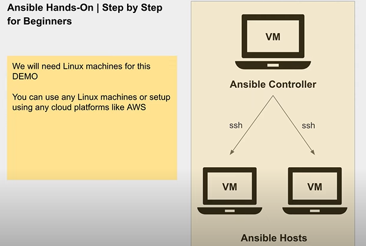

# Ansible-hands-on-project
This project aims to establish a centralized management framework for two Linux host servers using Ansible deployed on a dedicated controller server. The controller will leverage SSH connections to communicate with the host servers and execute automation tasks defined in Ansible .

Key Actors:
    Controller Server: This server acts as the central point of control, hosting the Ansible installation and running playbooks to manage the host servers.
    Host Servers: These are the target servers subject to automated configuration and management through Ansible playbooks executed by the controller server.

Communication Protocol:
    SSH: Secure Shell protocol is used for secure communication between the controller server and the host servers, enabling Ansible to execute tasks on the hosts.

Project Goals:
    Centralized Management: Implement a centralized approach to manage and configure host servers, reducing manual intervention and improving efficiency.
    Automated Tasks: Utilize Ansible to automate routine tasks, ensuring consistency and accuracy in configuration across host servers.
    Scalability: Design the architecture for potential future expansion to manage a larger number of host servers.
# Getting started
In this project we are trying to understand Ansible by implementing simple or basic adhoc commands using ansible. So first we should connect to  the nodes/ hosts using ssh through controller, after connecting to the hosts we should add the hosts ip add in the inventory file of ansible and run whatever command we need. This project is solely for the purpose to understand ansible adhoc commands. In real time we may use ansible playbooks more but also adhoc commands comes into picture sometimes. 

# Implementation 

First login to the controller using root user. The controller can be a linux server/ ec2 instance or any VM. (Putty preferrable) Install Ansible in the controller using below commands 
"sudo apt update"
"sudo apt install ansible"
NOTE: sudo or yum and may vary according to your instance. Please check the docs to install Ansible if any problem occurs, attaching link below https://docs.ansible.com/ansible/2.9/installation_guide/intro_installation.html 
After installation check whether it got installed or no using the command below "ansible --version"
Now navigate to .ssh for generating an ssh key Use "cd /root/.ssh/"
Now generate a ssh key using the command "ssh-keygen", press Enter until the key got generated.
Now you should be able to see the generated key using command "ls -ltr" id_rsa.pub is the file where your key is present Open this file using "cat/vi/vi/nano filename" and copy this file content
Now open the node/host and navigate to /root/.ssh/ using "cd" 
You can see "Authorized keys" file in this location. In this authorized keys file paste the copied content at the end of the file. Now give permission to the authorized keys file and .ssh using "chmod 600 authorized_keys" and "chmod 700 .ssh"

Now you should be able to connect to the node through the controller using the command "ssh@nodeipaddress" from controller cli. Similarly setup the ssh connection between  node2 using the same procedure and try to check using "ssh@IPADD" Once all the connections are set we are ready to use adhoc commands and do the automation.
Now your ready to use the ansible adhoc commands 
You can try using the below commands 
"ansible nodes ls" 
syntax - "ansible groupname commandrequired"

The above command will list all the files and folders of the hosts which are present in the group nodes in the inventory file

# Theory explanation 
# Ansible 
Ansible is an open-source automation tool that simplifies configuration management, application deployment, task automation, and orchestration.
Basically, Ansible adhoc commands are used when you want to execute small commands (like "ls", etc) but when you want to execute bigger commands for configuration management or deploymet or automation it is suggested to use Ansible playbooks.

