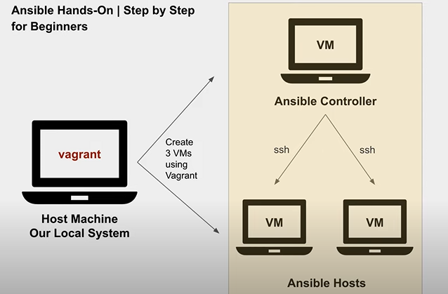

# Ansible-hands-on-project
This project aims to establish a centralized management framework for two Linux host servers using Ansible deployed on a dedicated controller server. The controller will leverage SSH connections to communicate with the host servers and execute automation tasks defined in Ansible playbooks.

Key Actors:
    Controller Server: This server acts as the central point of control, hosting the Ansible installation and running playbooks to manage the host servers.
    Host Servers: These are the target servers subject to automated configuration and management through Ansible playbooks executed by the controller server.

Communication Protocol:
    SSH: Secure Shell protocol is used for secure communication between the controller server and the host servers, enabling Ansible to execute tasks on the hosts.

Project Goals:
    Centralized Management: Implement a centralized approach to manage and configure host servers, reducing manual intervention and improving efficiency.
    Automated Tasks: Utilize Ansible playbooks to automate routine tasks, ensuring consistency and accuracy in configuration across host servers.
    Scalability: Design the architecture for potential future expansion to manage a larger number of host servers.
# Getting started

